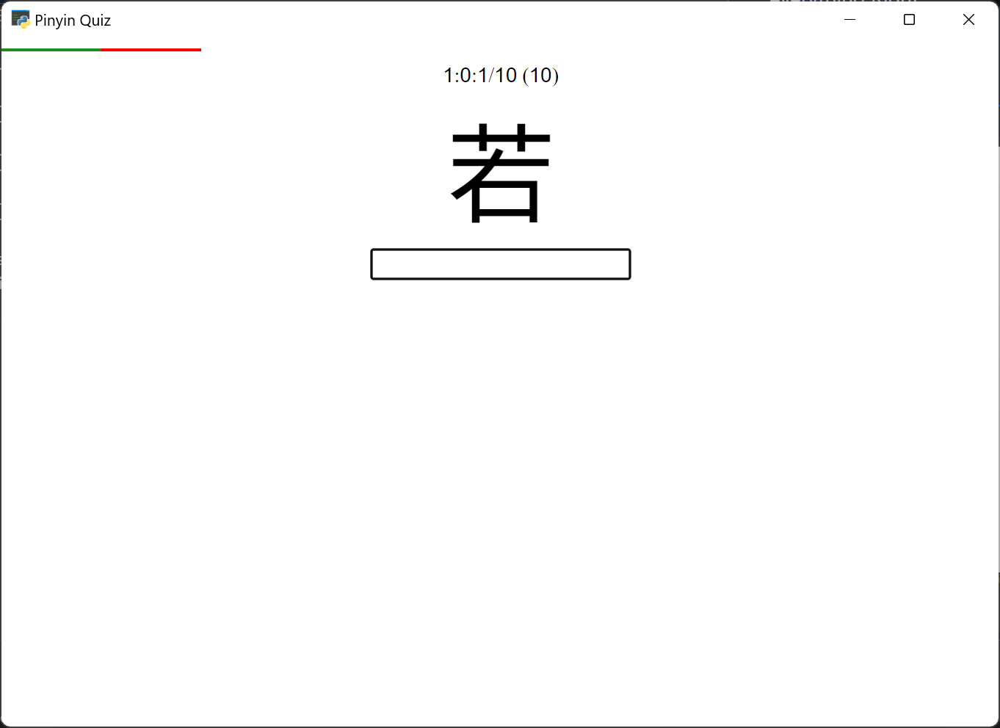
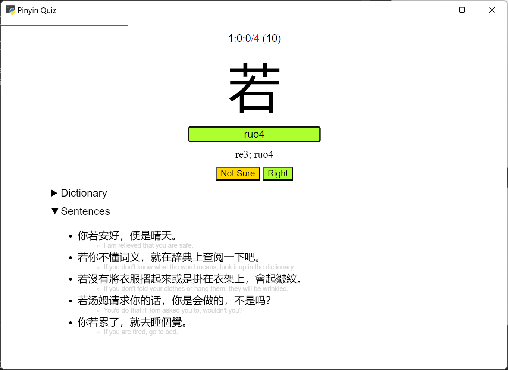

Start with a batch of 20. Will make a new batch if the previous has been surpassed.

After every rounds of not-Right's, there will be unlimited repeats until you get everything Right.

`ESC` for Not Sure / Skip.

Mulitple answers if applicable, separated by `;`.

User vocabularies at `vocab/**/*.txt` will be added to Due queue (if the entries exist in CEDICT).
