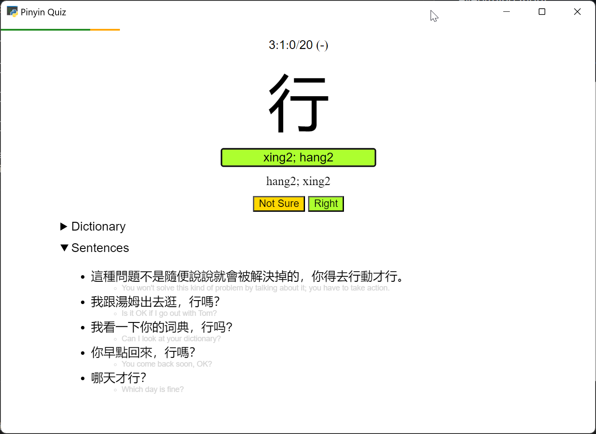

Start with a batch of 20. Will make a new batch if the previous has been surpassed.

After every rounds of not-Right's, there will be unlimited repeat drills until you get everything Right.

No typo checking. However, there is a middle-way button, "Not Sure".

`ESC` for Not Sure / Skip. `F1` or `F5` to end session and start the repeat drill or a new session.

Mulitple answers if applicable, separated by `;`.

User vocabularies at `user/vocab/**/*.txt` will be added to Due queue (if the entries exist in CEDICT). Skip lists can be put at `user/skip/**/*.txt`.

## Vocab list ideas

- [Hanzi levels](https://github.com/zhquiz/level/blob/master/_data/generated/vocab.yaml) ([zhquiz-vocab.yaml](/assets/zhquiz-vocab.yaml))
