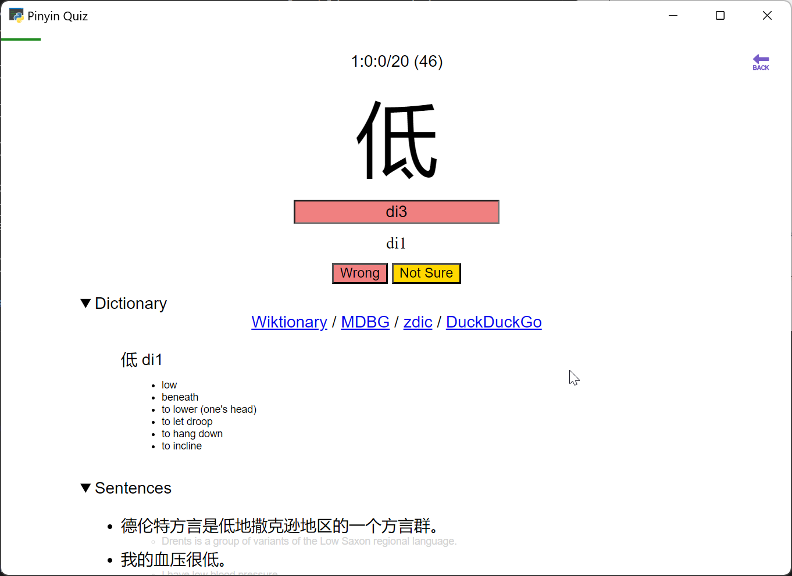
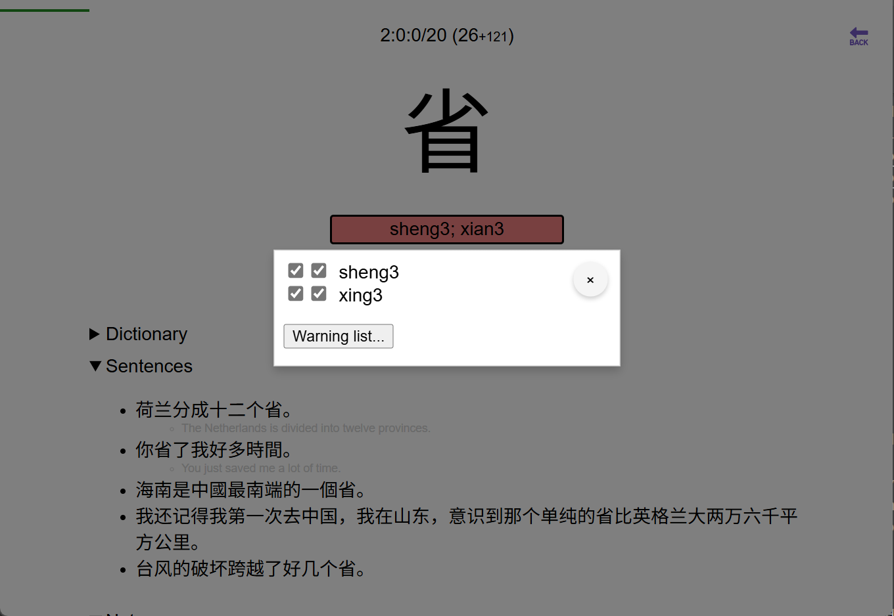
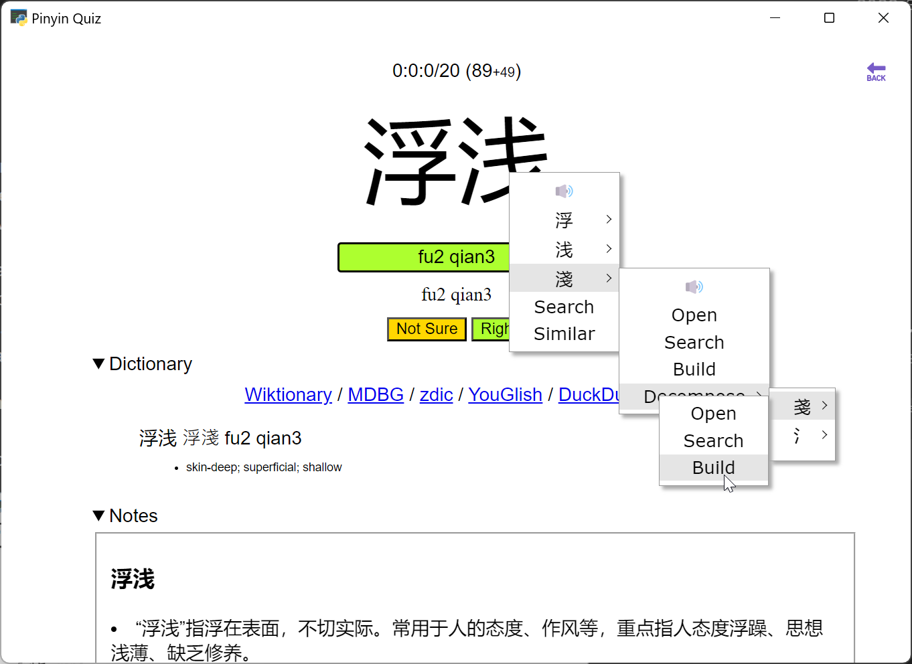
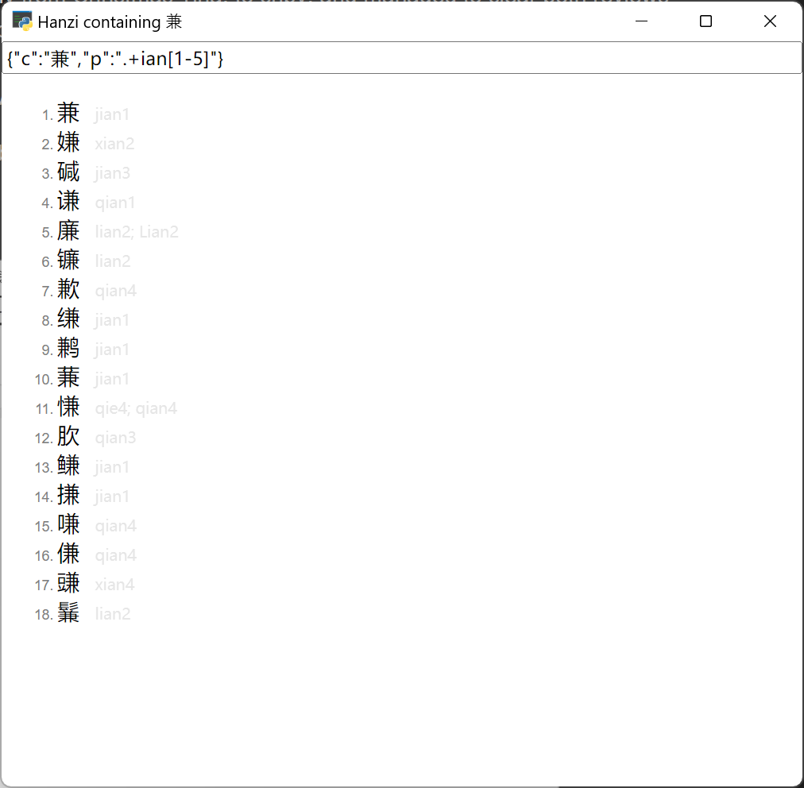
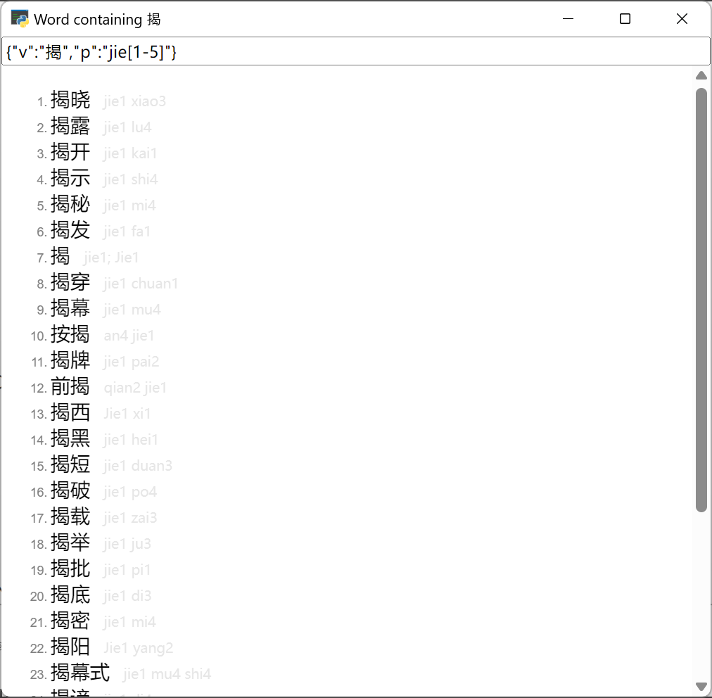
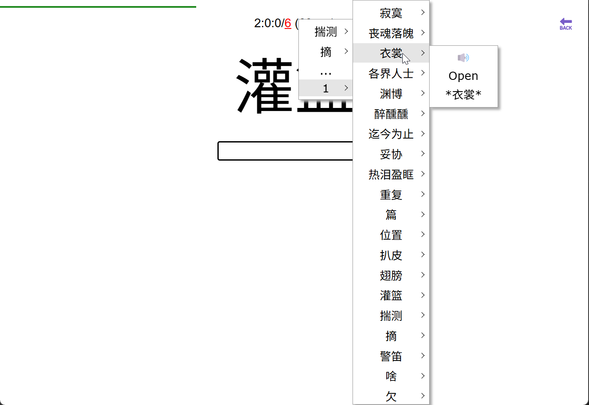
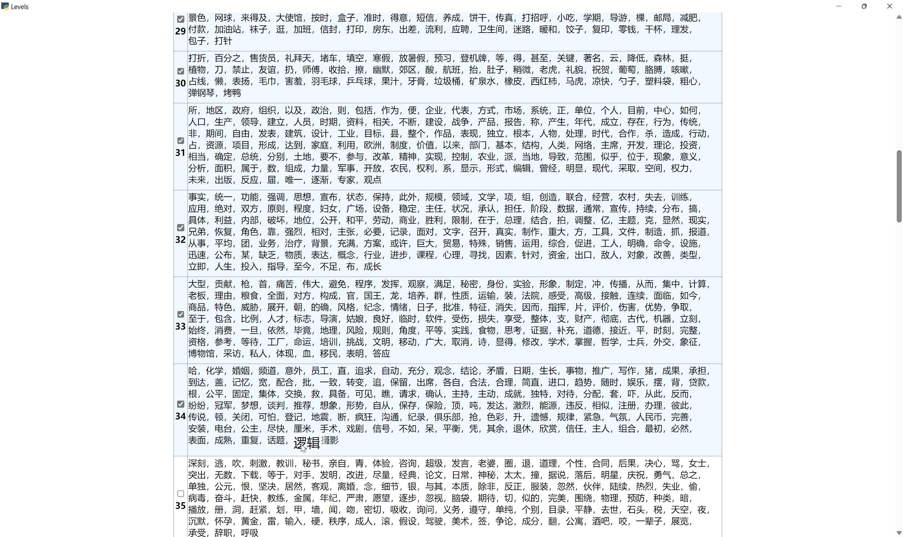
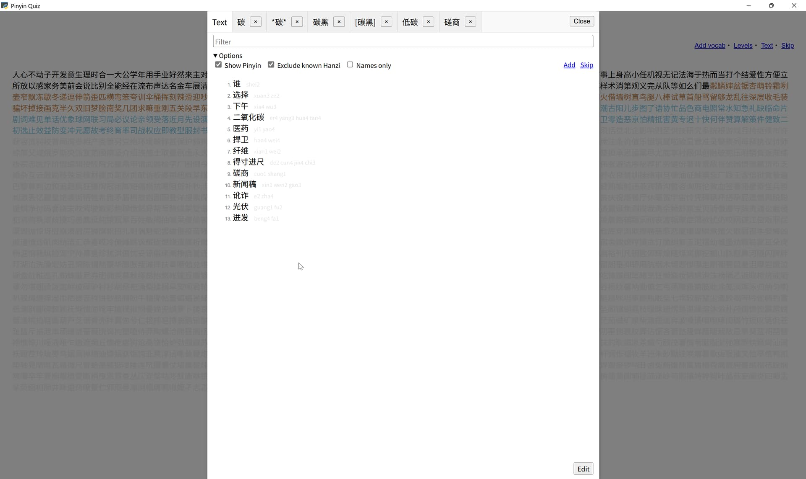
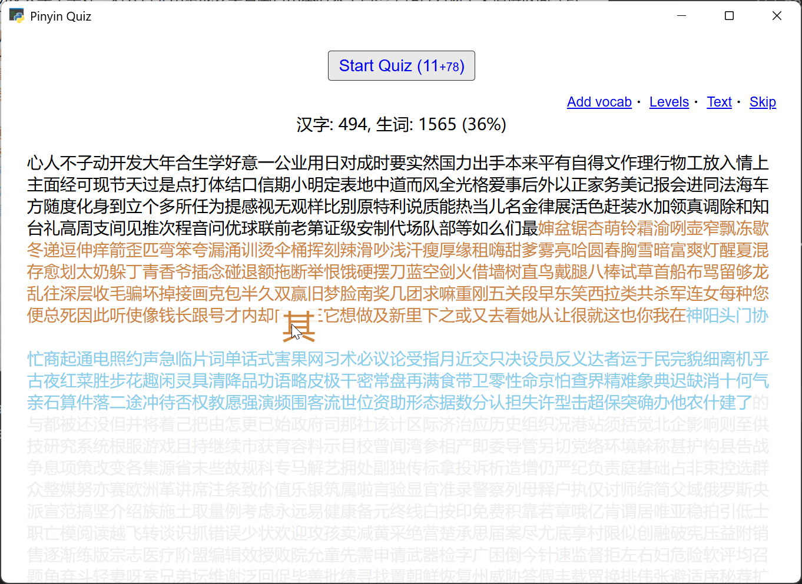

# cnpy

Start with a batch of 20. Then, a new batch if the previous has been surpassed.

After every rounds of not-Right's, there will be unlimited repeat drills until you get everything Right. Additionally, if too many wrongs (10), the repeat drill will start earlier.

No typo checking. No turning to Wrong or Right. However, there is a middle-way button, "Not Sure".

- `v` is accepted for `u:` or `ü` (for IME practice)
- `ESC` for Not sure
- `Ctrl+Z` for Undo and redo later (move to the end of the queue)
- `F5` to End the current batch, and start the wrong drill or make a new batch.
- Mulitple answers if applicable, separated by `;` (whitespaces are ignored). Important readings can be forced to require. Uncommon readings can be disabled and made wrong.
- Custom vocabularies can be added, and will be put to the end of Due queue (if the entries exist in [the dictionary](https://www.mdbg.net/chinese/dictionary))
- Skip vocabularies can be set, if accidentally put to SRS, or considered practically uncommon.

Note taking is powered bidirectionally by markdown (via [showdown.js](https://showdownjs.com/)). The content may be copy+pasted from websites in Dictionary links. AI dictionary may be configured by `.env` at the root of the project, to cover for monolingual definitions, colloquial usages, and grammar explanation.

Right-click context menu to check for similar Hanzi and vocabularies. The context-menu is also for TTS (speech synthesis), extra menu and updating CC-CEDICT.

Also, to access quiz history.

## Vocab lists

- [60 levels](/assets/zhquiz-level/) are from [ZhQuiz project](https://github.com/zhquiz/level/blob/master/_data/generated/vocab.yaml), generated from HSK1-6 vocab list, sorted for vocabularies with common Hanzi first.
  - HSK1 - Level 1-5
  - HSK2 - Level 6-10
  - HSK3 - Level 11-20
  - HSK4 - Level 21-30
  - HSK5 - Level 31-40
  - HSK6 - Level 41-60

## Text analysis

Native Chinese articles can be parsed, and optionally, added to new vocab list. New Hanzi and names can be filtered. Quizzed vocabularies are excluded from the result.

## Statistics

Technically, only [fsrs](https://pypi.org/project/fsrs/) `difficulty < 6` is counted as learned. Accuracy is `learned/started * 100%`.

Hanzi learned is calculated from

1. Used in at least 5 vocabularies
2. Learned as a vocabulary with lone or single repeated Hanzi
3. Used in at least 3 vocabularies

## Dictionaries

Vocabularies are from [CC-CEDICT](https://www.mdbg.net/chinese/dictionary?page=cc-cedict) at [MDBG Chinese Dictionary](https://www.mdbg.net/chinese/dictionary).

Sentences are from [Tatoeba project](https://tatoeba.org).

Hanzi decomposition data are from [CJKV (Chinese Japanese Korean Vietnamese) Ideograph Database](https://github.com/cjkvi/cjkvi-ids).

## Configuration

AI dictionary and TTS can be configured by `.env` put beside the exe or Python root.

* Set `CNPY_MAX_NEW=0` to do reviews to 0 first before adding new items.
* Set `TTS_VOICE=0` to use web TTS and disable [gTTS](https://github.com/pndurette/gTTS?tab=readme-ov-file#disclaimer)/emoti-voice. Run [emoti-voice](https://github.com/netease-youdao/EmotiVoice?tab=readme-ov-file#quickstart) and set `TTS_VOICE` to [a voice](https://github.com/netease-youdao/EmotiVoice/wiki/😊-voice-wiki-page) to use emoti-voice.
* Set `OPENAI_API_KEY` , `OPENAI_API_BASE`, `OPENAI_MODEL` to use [DeepSeek](https://api-docs.deepseek.com/) / [ChatGPT](https://platform.openai.com/docs/models), etc.
* Install [ollama](https://ollama.com) and set `OLLAMA_HOST`, `OLLAMA_MODEL` to use offline AI.
