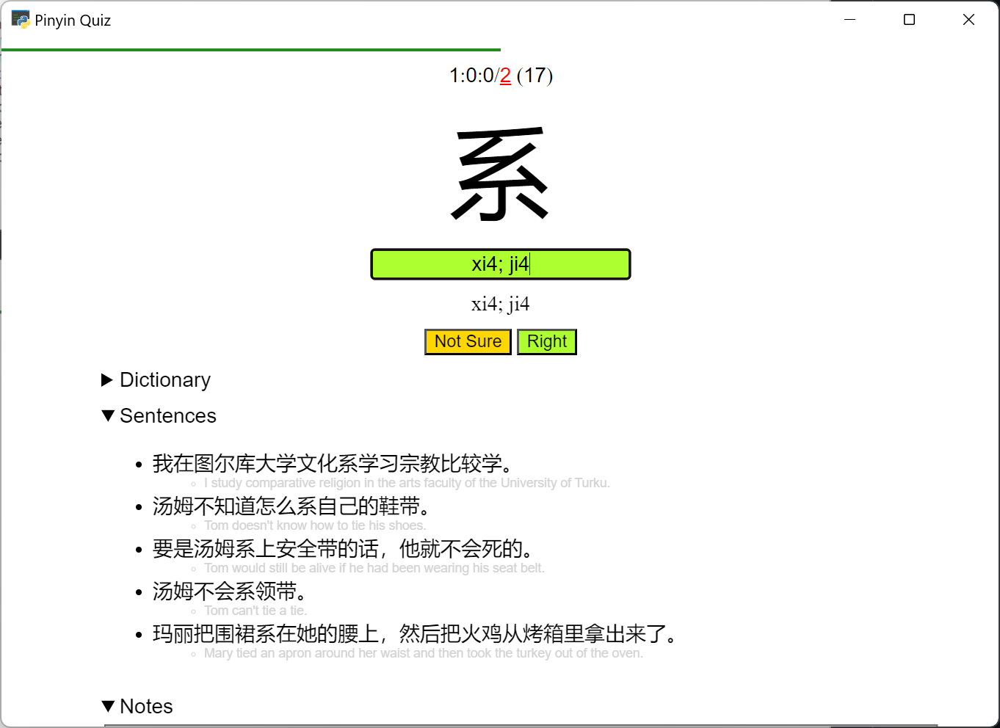
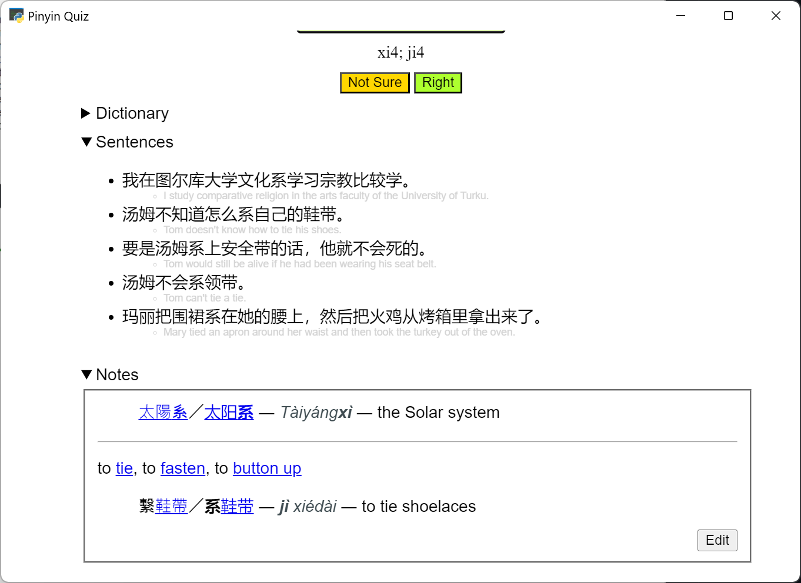
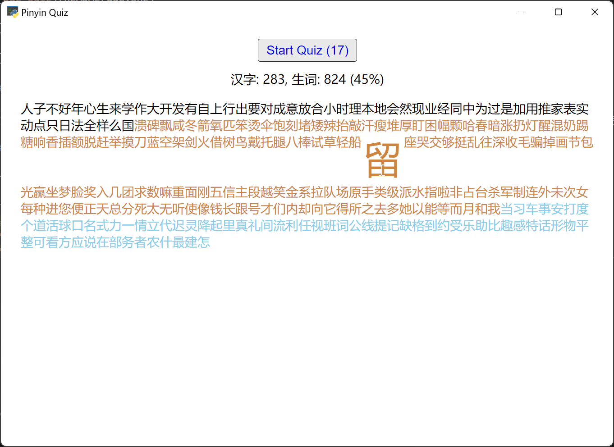

Start with a batch of 20. Will make a new batch if the previous has been surpassed.

After every rounds of not-Right's, there will be unlimited repeat drills until you get everything Right. Additionally, if too many wrongs (10), the repeat drill will start earlier.

No typo checking. However, there is a middle-way button, "Not Sure".

- `v` is also accepted for `u:` or `ü` (for IME practice).
- `ESC` for Not Sure / Skip
- `Ctrl+Z` for undo and redo later (move to the end of the queue)
- `F1` or `F5` to end the current session, and start the repeat drill or a new session.
- Mulitple answers if applicable, separated by `;`. Uncommon Pinyin readings can be temporarily disabled.
- [Custom vocabularies](/user/vocab/) can be added, and will be put to the end of Due queue (if the entries exist in [the dictionary](https://www.mdbg.net/chinese/dictionary))
- Chosen vocabularies can be added to [Skip](/user/skip/). For example, if some vocab are accidentally added to the SRS or practically uncommon.

Note taking is powered bidirectionally by markdown ([showdown.js](https://showdownjs.com/)). The content may be copy+pasted from websites in Dictionary links.

## Vocab lists

- [60 levels](/assets/zhquiz-level/) are from [ZhQuiz project](https://github.com/zhquiz/level/blob/master/_data/generated/vocab.yaml), generated from HSK1-6 vocab list, sorted for vocabularies with common Hanzi first.
  - HSK1 - Level 1-5
  - HSK2 - Level 6-10
  - HSK3 - Level 11-20
  - HSK4 - Level 21-30
  - HSK5 - Level 31-40
  - HSK6 - Level 41-60

## Text analysis

Native Chinese articles can be parsed and added to new vocab list. By default, vocab will appear in New more often, rather than added to Due queue.

## Statistics

Technically, only [fsrs](https://pypi.org/project/fsrs/) `difficulty < 6` is counted as learned. Accuracy is `learned/started * 100%`.

Hanzi learned is calculated from

1. Used in at least 5 vocabularies
2. Learned as a vocabulary with lone or single repeated Hanzi
3. Used in at least 3 vocabularies
